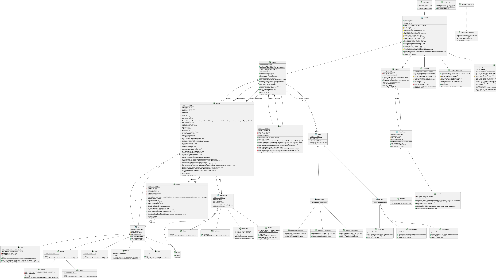

# POO Java TP Monstre - Maven Edition

## Membres

- MARMION Steven
- RIBEROU Kylian

Etudiants en 3A FISA à l'ESIEA


## Description du projet

Monstre Poche est un jeu de combat au tour par tour développé en Java avec JavaFX, inspiré de l'univers des monstres de poche. Le projet implémente une architecture MVC complète avec un système de combat stratégique incluant des types, des statuts et des objets.

---

## Démarrage rapide

### Prérequis

- Java 17 ou supérieur
- Maven 3.6 ou supérieur

### Installation

1. **Cloner le projet**
```bash
git clone https://github.com/stevenMarmion/monstre-poche
cd monstre-poche
```

2. **Compiler le projet**
```bash
mvn clean install -DskipTests
```

3. **Exécuter l'application**
```bash
# Ou avec exec:java (choisir son mode de lancement)
mvn exec:java

# Ou lancer l'interface graphique directement Avec Maven
mvn javafx:run
```

4. **(Optionnel) générer la javadoc**
```bash
# générer la javadoc
mvn javadoc:javadoc
# la consulter
open target/reports/apidocs/index.html
```
---

## Documentation

Diagramme de classes des modèles.



---

Vidéo de démonstration du mode en ligne par interface : 

```bash
#chemin
./demo-online-with-interface-gamemode.MP4
```

## Technologies utilisées

- **Langage** : Java 17
- **Build Tool** : Maven 3.6+
- **Interface graphique** : JavaFX 21.0.2
- **Tests** : JUnit 5.9.3
- **Architecture** : MVC 

---

## Fonctionnalités implémentées

- Mode de jeu, par terminal ou par interface graphique, en local contre un bot ou un joueur, ou en ligne.

### Système de combat

#### Combat au tour par tour
- Système de combat stratégique avec gestion des tours
- Ordre d'attaque basé sur la statistique de vitesse des monstres
- Gestion automatique du changement de monstre en cas de KO
- Vérification de fin de combat (tous les monstres d'une équipe KO)

#### Modes de jeu
- **Mode Local** : Combat entre deux joueurs sur la même machine
- **Mode Bot** : Combat contre une intelligence artificielle
- **Mode En Ligne** : Combat en réseau entre deux joueurs (système client-serveur)

### Système de types

#### Types élémentaires
- **Eau** : Fort contre Feu, Faible contre Foudre
  - Capacité spéciale : Inondation du terrain (probabilité configurable)
  - Effet : Fait chuter les monstres non-Eau
- **Feu** : Fort contre Nature, Faible contre Eau
  - Capacité spéciale : Brûlure de la cible
  - Effet : Dégâts continus à chaque tour
- **Foudre** : Fort contre Eau, Faible contre Terre
  - Capacité spéciale : Paralysie de la cible
  - Effet : Risque de rater son attaque
- **Terre** : Fort contre Foudre, Faible contre Nature
  - Capacité spéciale : Fuite sous terre
  - Effet : Augmentation temporaire de la défense
- **Nature** : Classe abstraite pour Plante et Insecte
  - Capacité spéciale : Récupération de PV sur terrain inondé
- **Plante** : Fort contre Eau, Faible contre Feu
  - Capacité spéciale : Soigne les altérations de statut
- **Insecte** : Fort contre Plante, Faible contre Feu
  - Capacité spéciale : Empoisonnement tous les 3 tours
- **Normal** : Fort contre Terre, Faible contre Nature
  - Type équilibré sans capacité spéciale

#### Système d'avantages de types
- Multiplicateur de dégâts x2 si type fort contre adversaire
- Multiplicateur de dégâts x0.5 si type faible contre adversaire
- Affichage des informations de type pendant le combat

### Système de statuts

#### Statuts de monstre
- **Brûlé** : Perd des PV à chaque tour (1/10 de l'attaque)
- **Paralysé** :
  - Durée maximale de 6 tours
  - Probabilité croissante de sortir de la paralysie
- **Empoisonné** : Perd des PV à chaque tour (1/10 de l'attaque)
- **Sous Terre** :
  - Défense doublée pendant 1 à 3 tours
  - Retour automatique à la normale après la durée
- **Normal** : Aucune altération

#### Statuts de terrain
- **Inondé** :
  - Déclenché par les monstres de type Eau
  - Durée de 1 à 3 tours
  - Effets sur les monstres non-Eau :
    - Soigne les statuts Brûlé et Empoisonné
    - Risque de chute (dégâts et attaque ratée)
  - Permet aux types Nature de récupérer des PV
  - Retrait automatique quand le monstre source quitte le terrain
- **Asséché** : État normal du terrain

### Système d'attaques

#### Mécaniques d'attaque
- **Attaques spéciales** :
  - 4 attaques maximum par monstre
  - PP (Points de Pouvoir) limités par attaque
  - Puissance et type personnalisables
  - Probabilité d'échec configurable
- **Attaque à mains nues** :
  - Disponible quand toutes les attaques sont épuisées
  - PP illimités
  - Puissance faible basée sur les statistiques
- **Calcul des dégâts** :
  - Formule prenant en compte attaque, défense et puissance
  - Coefficient aléatoire pour la variance
  - Multiplicateur de type (avantage/désavantage)

### Système d'objets

#### Potions
- **Potion de Santé (Hyper et Super potion)** : Restaure les points de vie (max = PV max)
- **Potion de Dégât** : Augmente l'attaque du monstre
- **Potion de Vitesse** : Augmente la vitesse du monstre

#### Médicaments
- **Médicament Anti-Brûlure** : Soigne le statut Brûlé
- **Médicament Anti-Paralysie** : Soigne le statut Paralysé
- **Médicament Anti-Poison** : Soigne le statut Empoisonné

#### Gestion d'inventaire
- Maximum 5 objets par joueur
- Utilisation d'objet compte comme une action de tour
- Suppression automatique après utilisation

### Système de joueurs

#### Gestion d'équipe
- Maximum 3 monstres par équipe
- Sélection du monstre actif
- Changement de monstre pendant le combat
- Détection automatique de défaite (tous monstres KO)

#### Intelligence Artificielle (Bot)
- Plusieurs modes de difficulté
- Choix automatique de la meilleure attaque disponible
- Stratégie basée sur les PP restants
- Gestion autonome des tours de combat

### Interface utilisateur

#### Interface graphique JavaFX
- **Menu principal** :
  - Sélection du mode de jeu (Local, Bot, En Ligne)
  - Navigation claire entre les écrans
- **Écran de sélection** :
  - Sélection de 3 monstres parmi les disponibles
  - Sélection de 4 attaques par monstre (filtrées par type)
  - Sélection de 5 objets pour l'inventaire
- **Écran de combat** :
  - Affichage des deux monstres en combat
  - Barres de PV avec code couleur (vert, orange, rouge)
  - Informations de statut en temps réel
  - Système de logs détaillés dans un panneau dédié
  - Boutons d'action : Attaque, Sac, Pokémon, Fuite
  - Sélection d'attaque avec affichage des PP
  - Changement de monstre (filtrage des monstres KO)
  - Utilisation d'objets
- **Écran de victoire** :
  - Affichage du vainqueur
  - Retour au menu principal

### Système de logs

#### Logger de combat
- Enregistrement de toutes les actions de combat
- Formatage des messages pour l'interface graphique
- Séparation des logs par tour
- Affichage des informations importantes :
  - Début et fin de combat
  - Actions des joueurs
  - Dégâts infligés
  - Changements de statut
  - Effets de type
  - Utilisation d'objets

### Système de ressources

#### Chargement des données
- **GameResourcesFactory** : Pattern Singleton pour l'accès aux ressources
- **GameResourcesLoader** : Chargement depuis fichiers texte
- Fichiers de configuration :
  - `monstres.txt` : Définition des monstres (nom, stats, type)
  - `attaques.txt` : Définition des attaques (nom, PP, puissance, type)
  - `objets.txt` : Définition des objets (nom, type, effet)

#### Persistance
- Sérialisation des objets pour le jeu en ligne
- Copie profonde des monstres et attaques pour éviter les modifications croisées

### Architecture logicielle

#### Pattern MVC (Model-View-Controller)
- **Models** : Logique métier et données
- **Views** : Interface utilisateur JavaFX
- **Controllers** : Coordination entre Models et Views
- **INavigationCallback** : Interface de navigation entre les vues

#### Patterns de conception
- **Template Method** : Classe abstraite `Combat` avec implémentations spécifiques
- **Factory** : `GameResourcesFactory` pour la création de ressources
- **Singleton** : Instance unique de `GameResourcesFactory`
- **Strategy** : Différentes stratégies de combat (Local, Bot, En Ligne)

### Fonctionnalités techniques

#### Gestion du réseau
- Serveur de jeu en ligne avec sockets
- Client de connexion au serveur
- Protocole de communication par événements
- Sérialisation des objets pour l'envoi réseau

#### Gestion des erreurs
- Validation des entrées utilisateur
- Gestion des cas limites (PP épuisés, monstres KO)
- Messages d'erreur clairs dans l'interface
- Logs détaillés pour le debugging

#### Performance
- Utilisation de JavaFX pour une interface fluide
- Gestion efficace de la mémoire avec copie d'objets
- Cache des ressources chargées

---

## Structure du projet

```
monstre-poche/
├── pom.xml                          # Configuration Maven
├── README.md                        
├── docs/
│   └── uml/                         # Diagrammes UML
│
├── src/
│   ├── main/
│   │   ├── java/com/esiea/monstre/poche/
│   │   │   ├── MonstrePoche.java           # Point d'entrée console
│   │   │   │
│   │   │   ├── controllers/                # Contrôleurs MVC
│   │   │   │   ├── INavigationCallback.java
│   │   │   │   ├── battle/
│   │   │   │   ├── menu/
│   │   │   │   ├── selection/
│   │   │   │   └── setup/
│   │   │   │
│   │   │   ├── models/                     # Modèles métier
│   │   │   │   ├── core/                   # Classes de base
│   │   │   │   ├── battle/                 # Système de combat
│   │   │   │   ├── types/                  # Types de monstres
│   │   │   │   ├── status/                 # Statuts
│   │   │   │   ├── items/                  # Objets
│   │   │   │   ├── game/                   # Gestion du jeu
│   │   │   │   └── network/                # Jeu en ligne
│   │   │   │
│   │   │   └── views/                      # Vues JavaFX
│   │   │       ├── MonstrePocheUI.java     # Point d'entrée GUI
│   │   │       └── gui/
│   │   │
│   │   └── resources/                      # Ressources
│   │       ├── attaques.txt
│   │       ├── monstres.txt
│   │       ├── objets.txt
│   │       ├── css/
│   │       └── images/
│   │
│   └── test/
│       └── java/                           # Tests unitaires
```


## Auteurs

Projet réalisé dans le cadre du cours de POO Java à l'ESIEA.
